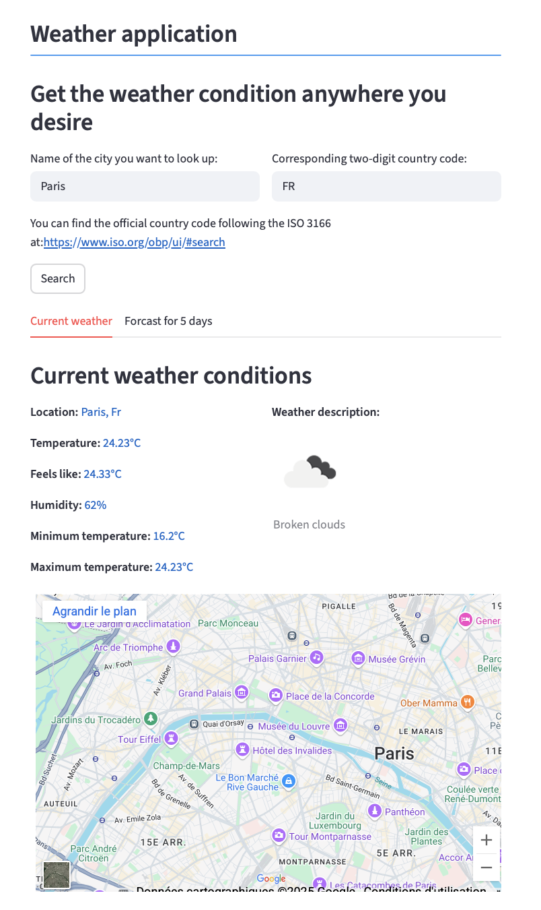
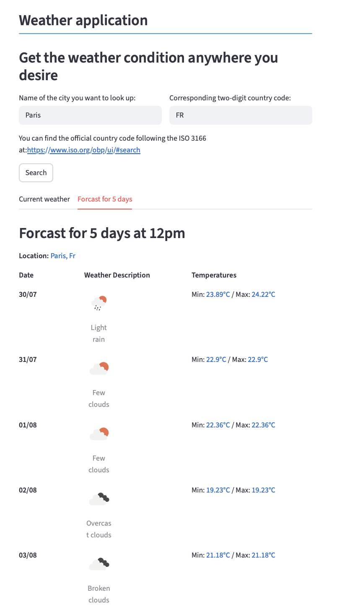

# Weather App

A simple and interactive weather application built with Python and Streamlit that provides current weather conditions, a 5-day forecast, and an embedded map using OpenWeatherMap and Google Maps APIs.

## Screenshots

Main screen:



5-day forecast screen:



## Features

- Get current weather data for any city and country code combination.
- View temperature, feels-like temperature, humidity, and weather description.
- Check a 5-day weather forecast with temperatures and descriptions, focused around midday.
- Display an interactive Google Map centered on the searched location.
- User-friendly interface powered by Streamlit.

## Technologies Used

- Python 3.9+
- Streamlit for UI
- OpenWeatherMap API for weather data
- Google Maps Embed API for map visualization
- requests for API calls
- python-dotenv for managing environment variables

## Installation

1. Clone the repository:

```
git clone https://github.com/ClaraBln/weather_app.git
cd weather-app
```

2. (Optional but recommended) Create and activate a virtual environment:

- On Unix/macOS:

  ```
  python3 -m venv venv
  source venv/bin/activate
  ```

- On Windows:

  ```
  python -m venv venv
  venv\Scripts\activate
  ```

3. Install dependencies:

```
pip install -r requirements
```

4. Create a `.env` file in the root folder with your API keys:

```
api_weather=your_openweathermap_api_key
api_map=your_google_maps_api_key
```

## Usage

Run the Streamlit app locally:

```
streamlit run main.py
```


- Enter the name of the city and the corresponding two-letter ISO country code.
- Click "Search" to view current weather and 5-day forecast tabs.
- Explore the interactive map and weather details.

## Configuration

Make sure you obtain and set environment variables for:

- `api_weather`: Your OpenWeatherMap API key.
- `api_map`: Your Google Maps Embed API key.

## Contributing

Contributions and suggestions are welcome! Please open an issue or submit a pull request.

## License

This project is licensed under the MIT License.  
See the [LICENSE](LICENSE) file for details.

## Contact

Clara Blanchard – clara-blanchard@live.fr

Project Link: [https://github.com/ClaraBln/weather_app.git](https://github.com/ClaraBln/weather_app.git)
